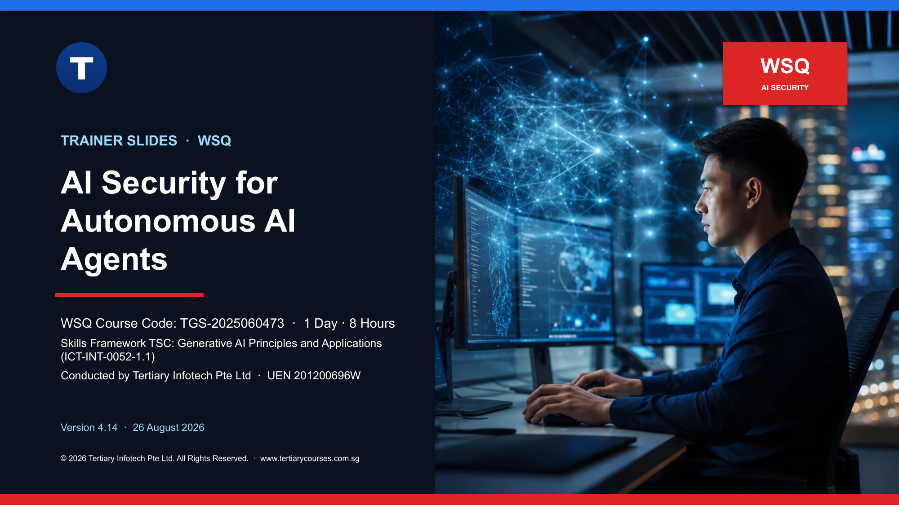

# 🤖 AI Security for Autonomous AI Agents

**A hands-on, one-day WSQ course on generative AI, agentic AI and AI agents — and how to use them safely.**

**[📝 Register for this course →](https://www.tertiarycourses.com.sg/wsq-ai-security-for-autonomous-ai-agents.html)**

**TSC:** Generative AI Principles and Applications (ICT-INT-0052-1.1) · **Courseware version:** 4.15 · 26 August 2026

A hands-on, one-day introduction to generative AI, agentic AI and autonomous AI agents, and the security, governance and ethical risks they bring to customer-service and hospitality settings. Learners work entirely on ready-made websites, chatbots and AI agents — **no coding is required**.

## Course structure

Three topics map one-to-one onto the three learning outcomes:

| Topic | Learning outcome | Focus |
|---|---|---|
| **Topic 1** | LO1 | Generative AI, agentic AI and AI agents — a short history (2023 GenAI → 2024 context engineering → 2025 harness engineering → 2026 AI agents), how generative AI works, the agentic loop, OpenClaw and Hermes, skills, tools and multi-agent systems. |
| **Topic 2** | LO2 | Prompt engineering and post-training — running prompts through the Hermes agent on a MiniMax model to analyse data and build presentations, and installing tools and skills to lift output quality. |
| **Topic 3** | LO3 | Security risk of autonomous AI agents — AI data governance and accountability, job impact and redesign, AI-agent cybersecurity risks and a safe roll-out framework. |

## Activities (all no-code, ready-made)

| # | Activity | Topic | Tool |
|---|---|---:|---|
| 1 | Talk to an AI agent and reflect on the Pinboard | 1 | TIA Support WhatsApp (OpenClaw) |
| 2 | Analyse mock Excel marketing data into a charted .docx report | 2 | Hermes agent + MiniMax |
| 3 | Create a 10-slide AI-security PPT, then redesign it from an image template | 2 | Hermes agent + image template |
| 4 | Install tools and skills, re-run the tasks | 2 | Hermes agent |
| 5 | Draft an AI Data Governance Policy | 3 | Sample policy + prompts |
| 6 | Coach a worried team member (role-play) | 3 | Role-play simulator website + worked coaching transcript |
| 7 | Break a leaky chatbot, compare a guarded one | 3 | Two RAG chatbot websites |
| 8 | Reflect on agent security and decide go / no-go | 3 | Worksheet |

Activities 6 and 7 are self-contained websites (open `index.html` in a browser) powered by a learner-supplied OpenAI or MiniMax key. All data is fictional.

## Assessment

- **Written Assessment (SAQ):** 5 short-answer questions, one per knowledge statement (K1–K5).
- **Case Study:** 3 reflection tasks (one per LO1–LO3, two questions each) in which learners document their own observations from the activities they completed during the day.

Open book · Competent / Not Yet Competent · 1-hour assessment at the end of the day.

## Current learner-facing artifacts

| Artifact | Current file |
|---|---|
| Trainer deck | `courseware/WSQ - Master Trainer Slides - TGS-2025060473 - AI Security for Autonomous AI Agents-v414.pptx` and matching PDF |
| Learner Guide | `courseware/Learner Guide - TGS-2025060473 - AI Security for Autonomous AI Agents.docx` and PDF |
| Learner Guide Markdown | `courseware/LEARNER-GUIDE.md` |
| Lesson Plan | `courseware/Lesson Plan - TGS-2025060473 - AI Security for Autonomous AI Agents.docx` and PDF |
| Activities | Eight self-contained folders under `activities/`, each with Markdown, data files, printable PDFs and (for 5, 6 and 7) a ready-to-open website |

The trainer deck is 168 slides; the Learner Guide is ~170 pages; the Lesson Plan is a single-day schedule. Detailed procedures live in the Learner Guide and activity packs; the slides remain concept-led.

## Assessment boundary

The confidential `assessment/` folder is excluded from GitHub. Learner question papers are distributed through the approved Drive/LMS workflow; answer keys remain trainer-only and are never linked from LMS-TMS.

## Register

**Ready to join?**

**[www.tertiarycourses.com.sg → AI Security for Autonomous AI Agents](https://www.tertiarycourses.com.sg/wsq-ai-security-for-autonomous-ai-agents.html)**

---

© 2026 Tertiary Infotech Academy Pte Ltd · UEN 201200696W · All Rights Reserved.

